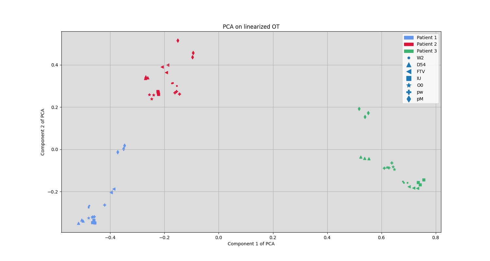

This is the code implementing our paper *Low dimensional representation of multi-patient flow cytometry datasets using optimal transport for minimalresidual disease detection in leukemia*. [[arXiv]](http://arxiv.org/abs/2407.17329).

# HIPC Dataset

The data can be bound as CSV files in the folder Data/HIPC/Data/CSV/. The first two or three letters of the files correspond to a laboratory where the data analysis was performed. The following number correspond to the patient and the replicate of the biological sample.

| Laboratory | Label |
| ---------- | ----- |
| Stanford | W2|
| NHLBI | D54 | 
| Yale | FTV |
| UCLA | IU |
| CIMR | O0 |
| Baylor | pw |
| Miami | pM |

| Patient | Replicate | Label |
| ------- | --------- | ----- |
| 1 | A | 1 |
| 1 | B | 2 |
| 1 | C | 3 |
| 2 | A | 4 |
| 2 | B | 5 |
| 2 | C | 6 | 
| 3 | A | 7 |
| 3 | B | 8 |
| 3 | C | 9 |

# Linearisation of optimal transport

In this paper, we propose a low-dimensional representation of flow cytometry measurements modeled as high-dimensional probability distributions. This is achieved by a step of mean measure quantization followed by an embedding of thos low-dimensional measures into a linear space, using the theory of linearised optimal transport.

This allows the visualisation of some potential clustering. In particular, in the above picture, we can distinguish patients even though flow cytometry measurements were analysed in different laboratories.

# Computations

## FlowSOM

The FlowSOM computations we use come from the following [package](https://github.com/saeyslab/FlowSOM_Python).

## K-means

For the K-means algorithm, we use the [scikit-learn package](https://scikit-learn.org/stable/index.html#).
